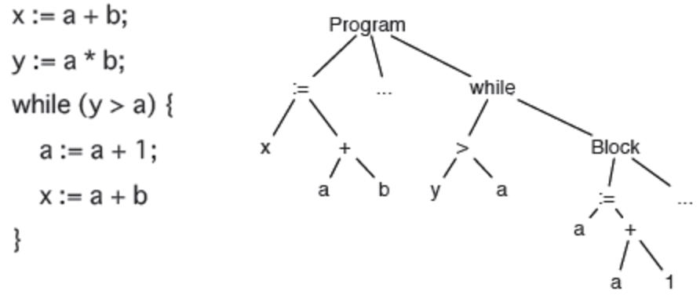
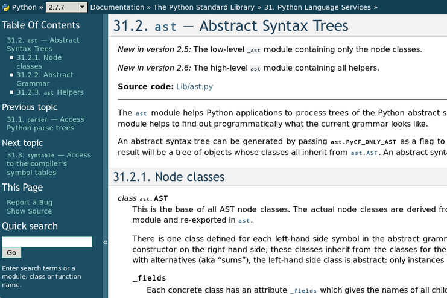
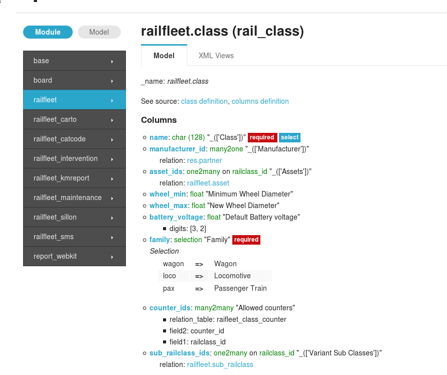
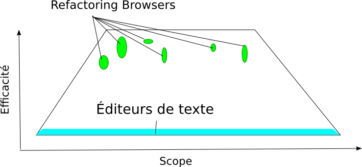
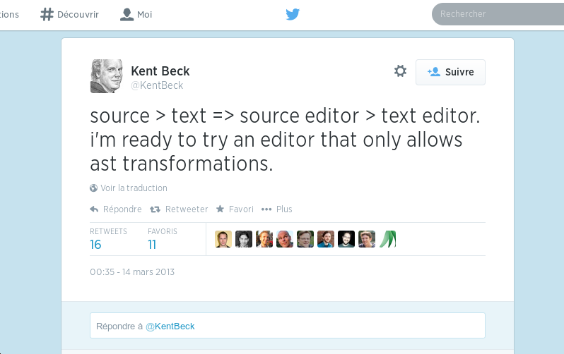

# Baron rendre le refactoring custom (en python) réaliste

---

# Avant de commencer

* talk technique avancé (mais compréhensible)
* Outil pour dev pour faire des outils pour dev
* Problèmes pas forcement évident pour les débutants

Est-ce que tout le monde comprend quand je dis ?

* Refactoring
* Abstract Syntaxe Tree (AST)

Si vous avez des questions de **comprehension** hésitez pas !

---

# Refactoring (eclipse)

---

# Abstract Syntaxe Tree (AST)

---

# Moi

* Belgique
* Code beaucoup trop (python (beaucoup), django, oueb, haskell, ...)
* Tourisme des langages de programmation
* Neutrinet (FFDN, Gitoyen)
* La Quadrature du Net/Nurpa
* UrLab (hackerspace à l'ULB/Bruxelles)/HSBxl (hackerspace à Bruxelles)

En beaucoup trop détailler:
[http://worlddomination.be/about/about.html](http://worlddomination.be/about/about.html)

---

# Plan

* Expériences (== pourquoi j'ai fait ça)
* Baron
* RedBaron
* Démo
* Futur
* Faim

---

# Expériences

---

# Refactoring custom

* J'ai toujours voulu écrire du code pour modifier mon code
* Très difficile: analyse, déplacement, trop de possibilités, syntaxe
* Frustrant, plein de cas où "ah, si seulement je pouvais scripter cette modification !"
* Comme une blessure à la lèvre
* Générer du code aussi

---

# Ast.py

---

# Ast.py

API Sax like

    !python
    class KeyAttributesFinder(ast.NodeVisitor):
        def visit_Assign(self, assign_node):
            # ...

        def visit_FunctionDef(self, function_node):
            # ...

        # visit_...

Super chiant, impossible à utiliser dans IPython efficacement.

---

# Ast.py

Pas lossless !

    ast_to_code(code_to_ast(code_source)) != source_code

(Commentaires, formatting)

(Et ast\_to\_code n'existe même pas (bon, maintenant y a une lib inconnu qui fait ça)).

---

# Generation de code

Django (memopol et co):

    stuff.json -> models.py import.py

Autre project:

    Générer du boilder plate en lisant des models de db

---

# pythonfmt

Auto formater du code python

---

# BeurpMiner

---

# Refactoring en python

* BycleRepairMan
* Rope (ast.py + regexs)
* PyCharm (?)
* Hyper dure: je suis en (x,y) dans un fichier, y a quoi autour de moi ?

---

# Refactoring: top to bottom

---

# ...

---

# Baron

---

# Baron

* ast lossless ! (FST == Full Syntaxe Tree)
* source == ast\_to\_code(code\_to\_ast(source))
* transforme un problème d'analyse de code en parcours/modification d'un graph
* output du json pour compatibilité maximum (+ structure de donnée simple)

*1 an de boulot (j'ai du apprendre)*

* +1000 tests (TDD)
* marche sur le top 100 de pypi
* utilities: position\_to\_path, position\_to\_node, boundinx\_box, walker etc...
* (encore quelques bugs ultra rare)

---

# Exemple

    !python

    from baron.helpers import show

    print show("1 + 2")

    [
        {
            "first_formatting": [
                {
                    "type": "space", 
                    "value": " "
                }
            ], 
            "value": "+", 
            "second_formatting": [
                {
                    "type": "space", 
                    "value": " "
                }
            ], 
            "second": {
                "section": "number", 
                "type": "int", 
                "value": "2"
            }, 
            "type": "binary_operator", 
            "first": {
                "section": "number", 
                "type": "int", 
                "value": "1"
            }
        }
    ]

---

# Parenthèse: pyfmt

---

# Suffisant ?

---

# Problèmes

* LossLess résolu
* json une base cool, mais hyper chiant à utiliser -> comme du bytecode
* besoin d'une abstraction cool à utiliser

---

# RedBaron

---

# RedBaron

* Api au dessus du FST de Baron
* Comme BeautifulSoup/Jquery
* Pour l'humain, ~user friendly~ (pour certaines définition de user)
* Pensé, entre autre, pour être utilisé dans IPython (ou bpython)

---

# RedBaron: exemple

    !python

    from redbaron import RedBaron

    red = RedBaron("print 'Hello World!'")

    red[0]  # print 'Hello World!'

    red.find('print')  # print 'Hello World!'
    red.print_  # print 'Hello World!'
    red.string  # 'Hello World!'

    red.find_all('print')  # [print 'Hello World!']
    red('print')  # [print 'Hello World!']

    red.string.value = "'Hello from RedBaron!'"
    red  # print 'Hello from RedBaron!'

---

# Démo

---

# Présent

2 core dev
Peut/pas de pub (première conf)

## Baron

* entièrement documenté
* version 0.2

## RedBaron

* plus jeune
* +100 tests
* entièrement documenté (plein d'exemples)
* 0.1 d'hier

## Installation

    pip install baron
    pip install redbaron

---

# Future

* Baron déjà assez stable
* Pub (haha)
* Focus sur RedBaron
* Commencer à rajouter de l'analyse de context dans redbaron ?
* RedFlyingBaron pour éditer son code avec RedBaron ?

---

---

# « Mec, t'es en train de coder le nouvel 'ed' du 21 ème siècle avec 4 niveaux d'abstractions en plus » Hastake - Fin bourré

---

# Infos

* [https://github.com/psycojoker/baron](https://github.com/psycojoker/baron)
* [https://github.com/psycojoker/redbaron](https://github.com/psycojoker/redbaron)
* [https://baron.readthedocs.org](https://baron.readthedocs.org)
* [https://redbaron.readthedocs.org](https://redbaron.readthedocs.org)
* Moi: cortex@worlddomination.be
